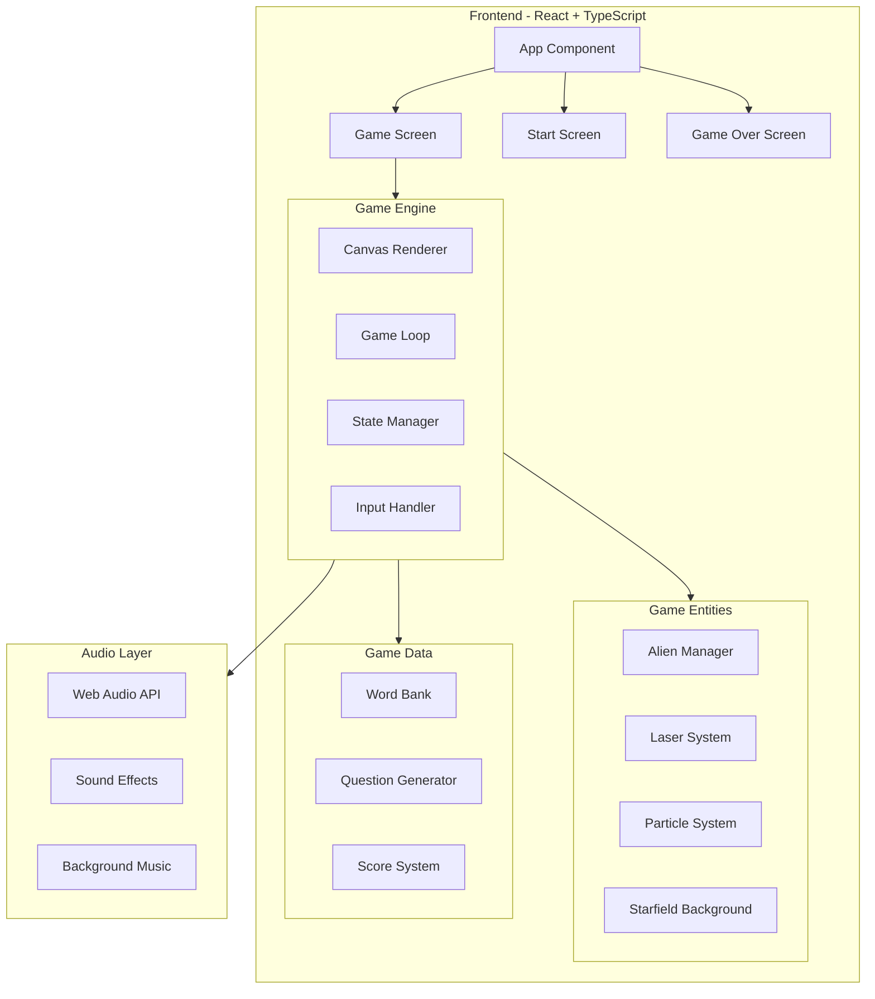

# IELTS Word Invaders - Technical Architecture Document

## 1. Architecture Design



## 2. Technology Description

| Layer | Technology | Version | Purpose |
|-------|------------|---------|---------|
| **Frontend Framework** | React | ^18.2.0 | UI component architecture |
| **Language** | TypeScript | ^5.0.0 | Type safety and developer experience |
| **Build Tool** | Vite | ^5.0.0 | Fast development and optimized builds |
| **Styling** | CSS Modules + Tailwind | ^3.4.0 | Component-scoped styles + utility classes |
| **Canvas API** | HTML5 Canvas | Native | 2D game rendering |
| **Audio API** | Web Audio API | Native | Procedural sound generation |

## 3. Project Structure

```
ielts-word-invaders/
├── public/
│   └── fonts/
│       └── PressStart2P-Regular.ttf    # Pixel font
├── src/
│   ├── components/
│   │   ├── Game/
│   │   │   ├── GameCanvas.tsx          # Main game canvas
│   │   │   ├── GameUI.tsx              # Score, lives, combo UI
│   │   │   ├── QuestionPrompt.tsx      # Question display
│   │   │   ├── AnswerInput.tsx         # Typing input
│   │   │   └── AlienGrid.tsx           # Alien formation component
│   │   ├── Screens/
│   │   │   ├── StartScreen.tsx
│   │   │   ├── GameOverScreen.tsx
│   │   │   └── PauseScreen.tsx
│   │   └── Common/
│   │       ├── NeonButton.tsx
│   │       ├── PixelText.tsx
│   │       └── Starfield.tsx
│   ├── hooks/
│   │   ├── useGameLoop.ts
│   │   ├── useCanvas.ts
│   │   ├── useAudio.ts
│   │   └── useInput.ts
│   ├── engine/
│   │   ├── GameEngine.ts
│   │   ├── Entity.ts
│   │   ├── Alien.ts
│   │   ├── Laser.ts
│   │   ├── Particle.ts
│   │   └── Starfield.ts
│   ├── data/
│   │   ├── wordBank.ts                 # 50+ IELTS words
│   │   └── questionGenerator.ts
│   ├── types/
│   │   └── game.types.ts
│   ├── utils/
│   │   ├── audioUtils.ts
│   │   ├── canvasUtils.ts
│   │   └── mathUtils.ts
│   ├── styles/
│   │   ├── global.css
│   │   └── neon-effects.css
│   ├── App.tsx
│   ├── main.tsx
│   └── vite-env.d.ts
├── index.html
├── package.json
├── tsconfig.json
├── vite.config.ts
└── tailwind.config.js
```

## 4. Data Models

### 4.1 Core Types

```typescript
// game.types.ts

interface WordData {
  word: string;
  definition: string;
  synonyms: string[];
  sentence: string;  // with blank: "This medicine should _____ the pain."
  band: 5 | 6 | 7;   // IELTS band level
}

interface Alien {
  id: string;
  x: number;
  y: number;
  width: number;
  height: number;
  word: string;           // Displayed word/definition
  wordData: WordData;     // Full word data for answer checking
  questionType: QuestionType;
  isAlive: boolean;
  bobOffset: number;      // For hover animation
}

type QuestionType = 'synonym' | 'definition' | 'fillBlank';

interface Question {
  type: QuestionType;
  prompt: string;
  correctAnswer: string;
  targetAlienId: string;
}

interface Particle {
  x: number;
  y: number;
  vx: number;
  vy: number;
  life: number;
  maxLife: number;
  color: string;
  size: number;
}

interface Laser {
  x: number;
  y: number;
  targetY: number;
  speed: number;
  isActive: boolean;
  color: string;
}

interface GameState {
  status: 'start' | 'playing' | 'paused' | 'gameOver';
  score: number;
  lives: number;
  wave: number;
  combo: number;
  comboMultiplier: number;
  currentQuestion: Question | null;
  inputText: string;
  wrongWords: WordData[];
}
```

## 5. Component Specifications

### 5.1 GameCanvas Component

```typescript
interface GameCanvasProps {
  gameState: GameState;
  aliens: Alien[];
  particles: Particle[];
  laser: Laser | null;
  onAnswerSubmit: (answer: string) => void;
}

// Responsibilities:
// - Initialize canvas context
// - Handle game loop rendering
// - Draw starfield background
// - Draw aliens with words
// - Draw laser effects
// - Draw particle explosions
// - Handle window resize
```

### 5.2 QuestionPrompt Component

```typescript
interface QuestionPromptProps {
  question: Question | null;
  inputText: string;
  onInputChange: (text: string) => void;
  onSubmit: () => void;
}

// Responsibilities:
// - Display question prompt with neon glow
// - Render typing input field
// - Handle Enter key submission
// - Show blinking cursor animation
// - Visual feedback on wrong answer
```

## 6. Audio System Design

### 6.1 Sound Effect Specifications

```typescript
interface SoundConfig {
  name: string;
  type: 'sine' | 'square' | 'sawtooth' | 'triangle';
  frequency: number;
  duration: number;
  volume: number;
  slide?: boolean;
  slideTo?: number;
}

// Sound Effects:
const SOUNDS: Record<string, SoundConfig> = {
  shoot: { type: 'square', frequency: 440, duration: 0.1, volume: 0.3, slide: true, slideTo: 880 },
  explosion: { type: 'sawtooth', frequency: 100, duration: 0.3, volume: 0.4, slide: true, slideTo: 50 },
  correct: { type: 'sine', frequency: 523, duration: 0.15, volume: 0.3 }, // C5
  wrong: { type: 'sawtooth', frequency: 150, duration: 0.2, volume: 0.3 },
  lifeLost: { type: 'square', frequency: 200, duration: 0.5, volume: 0.4, slide: true, slideTo: 100 },
  gameOver: { type: 'sawtooth', frequency: 300, duration: 1, volume: 0.3, slide: true, slideTo: 100 },
};
```

### 6.2 Audio Engine Implementation

```typescript
class AudioEngine {
  private ctx: AudioContext | null = null;
  private enabled: boolean = true;

  constructor() {
    this.init();
  }

  private init(): void {
    if (typeof window !== 'undefined') {
      this.ctx = new (window.AudioContext || (window as any).webkitAudioContext)();
    }
  }

  public playSound(config: SoundConfig): void {
    if (!this.ctx || !this.enabled) return;

    const osc = this.ctx.createOscillator();
    const gain = this.ctx.createGain();

    osc.type = config.type;
    osc.frequency.setValueAtTime(config.frequency, this.ctx.currentTime);

    if (config.slide) {
      osc.frequency.exponentialRampToValueAtTime(
        config.slideTo!,
        this.ctx.currentTime + config.duration
      );
    }

    gain.gain.setValueAtTime(config.volume, this.ctx.currentTime);
    gain.gain.exponentialRampToValueAtTime(0.01, this.ctx.currentTime + config.duration);

    osc.connect(gain);
    gain.connect(this.ctx.destination);

    osc.start(this.ctx.currentTime);
    osc.stop(this.ctx.currentTime + config.duration);
  }

  public play(name: keyof typeof SOUNDS): void {
    this.playSound(SOUNDS[name]);
  }

  public toggle(): void {
    this.enabled = !this.enabled;
  }
}
```

## 7. Game Loop & State Management

### 7.1 Game Loop Implementation

```typescript
class GameEngine {
  private canvas: HTMLCanvasElement;
  private ctx: CanvasRenderingContext2D;
  private animationId: number | null = null;
  private lastTime: number = 0;

  // Game state
  private aliens: Alien[] = [];
  private particles: Particle[] = [];
  private laser: Laser | null = null;
  private gameState: GameState;

  // Configuration
  private config = {
    alienRows: 5,
    alienCols: 8,
    alienSpacingX: 70,
    alienSpacingY: 60,
    alienSpeed: 0.3,
    waveSpeedIncrease: 0.1,
    baseScore: 100,
  };

  constructor(canvas: HTMLCanvasElement) {
    this.canvas = canvas;
    this.ctx = canvas.getContext('2d')!;
    this.gameState = this.createInitialState();
    this.init();
  }

  private createInitialState(): GameState {
    return {
      status: 'start',
      score: 0,
      lives: 3,
      wave: 1,
      combo: 0,
      comboMultiplier: 1,
      currentQuestion: null,
      inputText: '',
      wrongWords: [],
    };
  }

  private init(): void {
    this.setupEventListeners();
    this.resize();
  }

  public start(): void {
    this.gameState.status = 'playing';
    this.generateWave();
    this.gameLoop(0);
  }

  private gameLoop(timestamp: number): void {
    if (this.gameState.status !== 'playing') return;

    const deltaTime = timestamp - this.lastTime;
    this.lastTime = timestamp;

    this.update(deltaTime);
    this.render();

    this.animationId = requestAnimationFrame((ts) => this.gameLoop(ts));
  }

  private update(deltaTime: number): void {
    // Update aliens
    this.updateAliens(deltaTime);

    // Update particles
    this.updateParticles(deltaTime);

    // Update laser
    this.updateLaser(deltaTime);

    // Check collisions
    this.checkCollisions();

    // Check wave completion
    if (this.aliens.filter(a => a.isAlive).length === 0) {
      this.nextWave();
    }
  }

  private render(): void {
    // Clear canvas
    this.ctx.fillStyle = '#0a0a0f';
    this.ctx.fillRect(0, 0, this.canvas.width, this.canvas.height);

    // Draw starfield
    this.drawStarfield();

    // Draw grid lines
    this.drawGrid();

    // Draw aliens
    this.drawAliens();

    // Draw laser
    this.drawLaser();

    // Draw particles
    this.drawParticles();

    // Draw scanlines
    this.drawScanlines();
  }

  // Additional methods (generateWave, updateAliens, etc.)...
}
```

## 8. File Size Estimation

| Component | Estimated Size |
|-----------|---------------|
| Source Code | ~150 KB |
| Assets (Fonts) | ~50 KB |
| **Total Bundle** | **~200 KB** |

## 9. Implementation Phases

### Phase 1: Core Setup (Day 1)
- Project initialization with Vite + React + TypeScript
- Basic canvas setup and game loop
- Starfield background rendering

### Phase 2: Game Entities (Day 2)
- Alien formation and movement
- Laser system
- Particle effects
- Collision detection

### Phase 3: Game Logic (Day 3)
- Question generation system
- Answer validation
- Score and combo system
- Wave progression

### Phase 4: Audio & Polish (Day 4)
- Web Audio API integration
- Sound effects
- UI screens (start, game over)
- Responsive design

### Phase 5: Testing & Optimization (Day 5)
- Cross-browser testing
- Mobile optimization
- Performance tuning
- Final bug fixes

---

**Document Version:** 1.0  
**Created:** 2025-05-16  
**Status:** Draft
